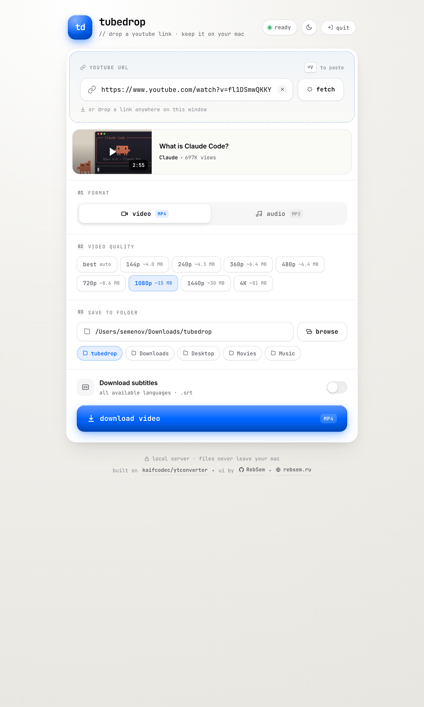
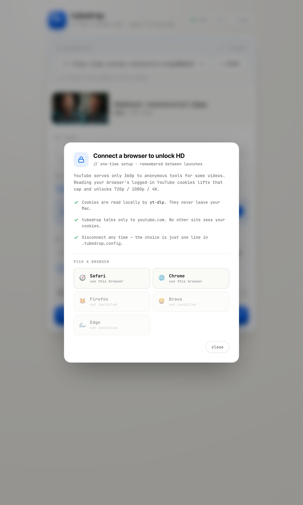

<div align="center">

# tubedrop

**Drop a YouTube link. Get the file.**



<sub>Built on [kaifcodec/ytconverter](https://github.com/kaifcodec/ytconverter) · ui by [@RebSem](https://github.com/RebSem) · [rebsem.ru](https://rebsem.ru)</sub>

</div>

---

## Why

I just wanted to save a video from YouTube. Every converter site I tried was the same:
sketchy popups, redirects, fake "Download" buttons, hard caps at 360p, and you walk away with nothing.

[**kaifcodec/ytconverter**](https://github.com/kaifcodec/ytconverter) already solved the hard part — `yt-dlp` and `ffmpeg` glued together perfectly. But it's a terminal tool with prompts.

I wrapped it in a small web UI so it's two clicks instead of ten keystrokes.

---

## Install — 2 clicks

1. [**Download the zip**](https://github.com/RebSem/tubedrop/archive/refs/heads/main.zip), unzip wherever you want.
2. Double-click `install.command`.

The installer takes ~30 seconds. It:
- Uses the system Python if it's 3.10 or newer, **otherwise downloads a self-contained Python 3.12 (~30 MB)** so you never have to think about Python versions.
- Drops a static `ffmpeg` binary into the project folder.
- Installs `yt-dlp` into a local virtual environment.
- Puts a `Tubedrop` shortcut on your Desktop.

No Homebrew. No `sudo`. No global installs. Everything stays in the project folder — delete the folder to uninstall.

> First time only: macOS may show *"can't be opened — unidentified developer"*. Right-click → **Open** → confirm.

---

## Use

Double-click `Tubedrop` on your Desktop → paste a link → pick a quality → hit `download`.

`Quit` in the top-right of the window cleanly stops the local server.

---

## Unlock HD (when YouTube caps to 360p)

Sometimes YouTube hides everything above 360p from anonymous tools. When that happens, tubedrop shows a banner in the Quality section:

<div align="center">
  
</div>

Click **unlock hd** → pick the browser you're logged into YouTube with (Safari / Chrome / Firefox / Brave / Edge). tubedrop tells `yt-dlp` to read that browser's YouTube cookies, which lifts the cap and unlocks 720p / 1080p / 4K.

- **Cookies never leave your Mac.** tubedrop talks only to `youtube.com`.
- **One-time setup.** Your choice is saved to `.tubedrop.config` and used on every launch.
- **Reversible.** Click the `hd · safari` chip in the header → **disconnect** to go back to anonymous mode.

---

## Files

```
tubedrop/
├── install.command       ← run once
├── Tubedrop.command      ← created by installer (and on Desktop)
├── README.md
├── docs/
│   ├── screenshot.png
│   └── hd-modal.png
└── ytconverter/          ← Python package
    ├── __main__.py
    ├── constants.py
    ├── utils/
    └── web/              ← local server + UI
        ├── server.py
        └── ui.py
```

After install, these appear (all gitignored):
- `.venv/` — local Python env with `yt-dlp`
- `.bin/ffmpeg` — bundled `ffmpeg` binary
- `.bin/python/` — bundled Python 3.12 (only when your system Python is too old)
- `.tubedrop.config` — your HD-unlock choice
- `.tubedrop.pid` / `.url` — runtime state while the server is up

---

## Credits

- Heavy lifting: [**kaifcodec/ytconverter**](https://github.com/kaifcodec/ytconverter) — go star them.
- Underneath: [yt-dlp](https://github.com/yt-dlp/yt-dlp), [ffmpeg](https://ffmpeg.org/).
- UI & packaging: [@RebSem](https://github.com/RebSem).

Licensed under MIT. See [LICENSE](LICENSE).

---

<sub>For personal use. Respect the [YouTube Terms of Service](https://www.youtube.com/static?template=terms).</sub>
